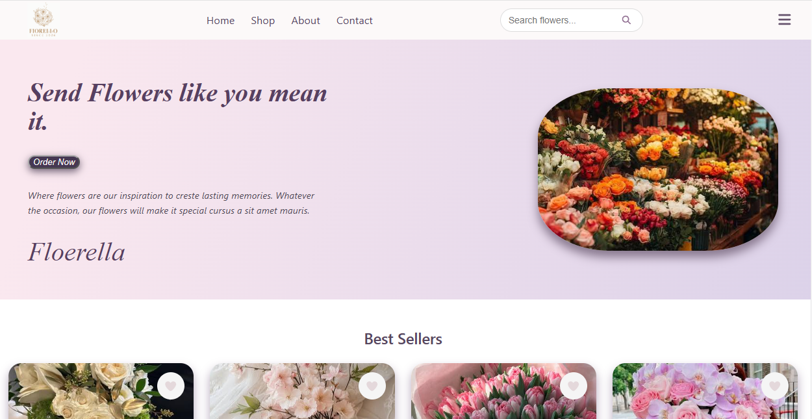
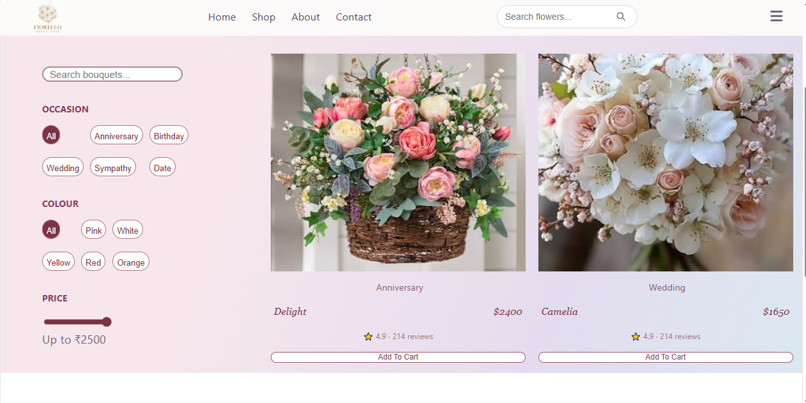
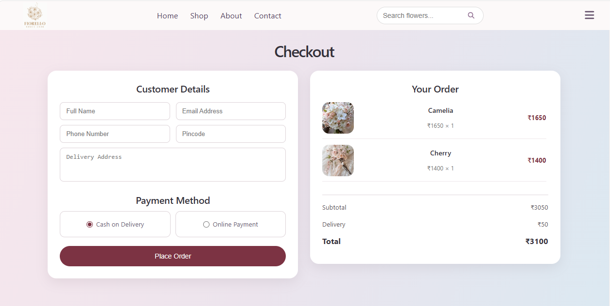
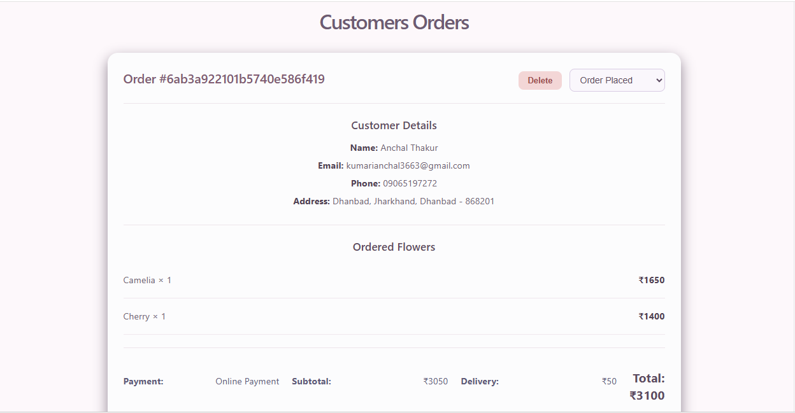
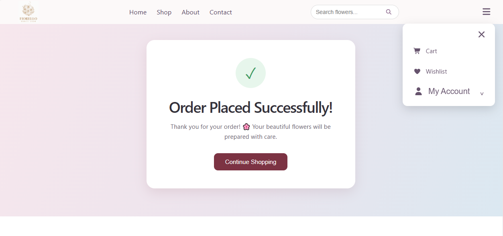

# 🌸 Floerella

A full-stack flower e-commerce website built with the MERN stack.

Floerella allows customers to browse flowers, filter products, manage their wishlist and cart, place orders, and track their orders. It also includes an admin panel for managing customer orders and order status.

## ✨ Features

### Customer
- User registration and login
- Browse flower products
- Search flowers
- Filter by occasion and colour
- Price filtering
- Wishlist management
- Add to cart
- Increase/decrease cart quantity
- Remove products from cart
- Checkout with customer details
- Cash on Delivery / Online Payment selection
- Order placement
- Order success page
- View previous orders
- View profile information

### Admin
- Admin login
- View all customer orders
- View customer details
- View ordered flowers
- Update order status
- Delete orders
- Admin logout

## 🛠️ Tech Stack

### Frontend
- React
- React Router
- Axios
- CSS
- Font Awesome
- Vite

### Backend
- Node.js
- Express.js
- MongoDB
- Mongoose
- JWT Authentication

## 📁 Project Structure

```text
Floerella/
│
├── Backend/
│   ├── config/
│   ├── controllers/
│   ├── middlewares/
│   ├── models/
│   ├── routes/
│   ├── server.js
│   └── package.json
│
├── public/
│
├── src/
│   ├── assets/
│   ├── components/
│   ├── context/
│   ├── data/
│   ├── pages/
│   ├── App.jsx
│   └── main.jsx
│
├── .gitignore
├── package.json
└── README.md

```

## 📸 Screenshots

### Home Page


### Shop Page


### Cart


### Checkout


### Customer Profile



### Order Success
